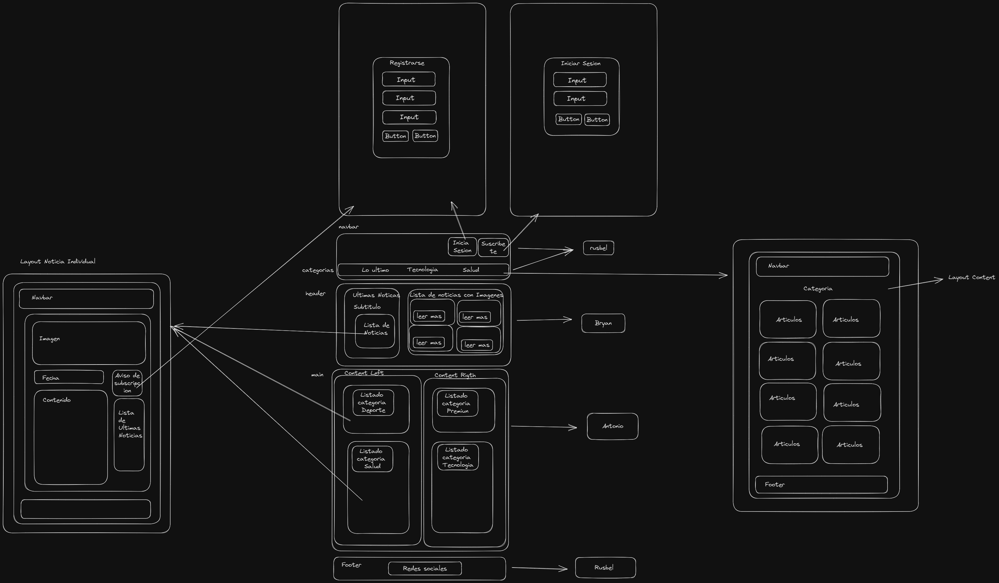
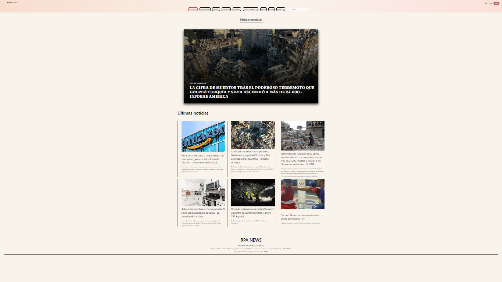
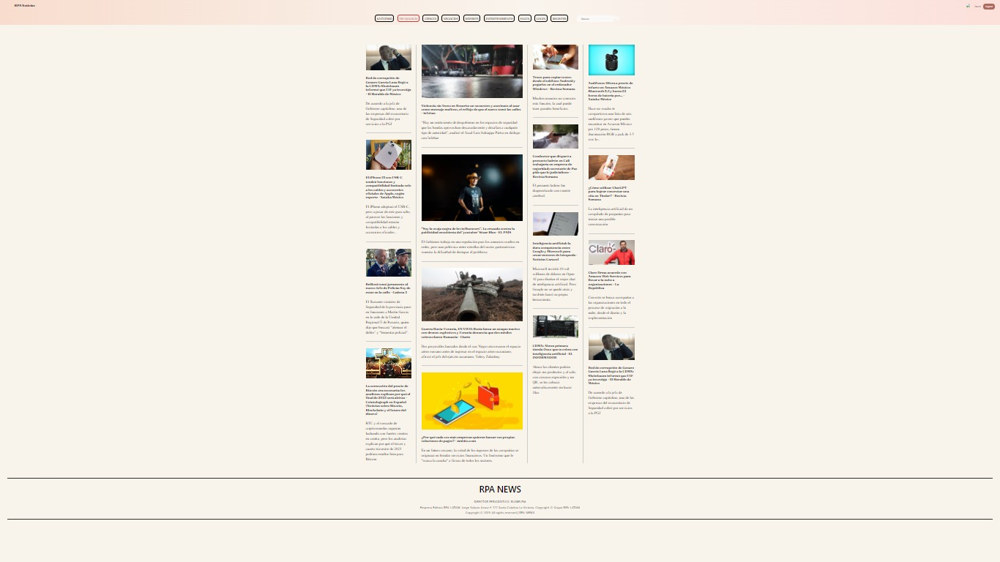
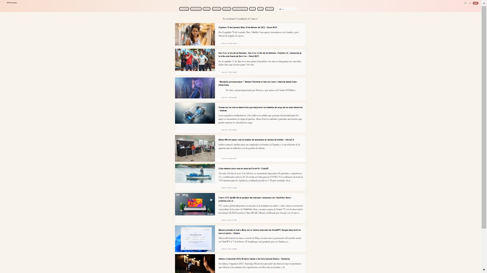
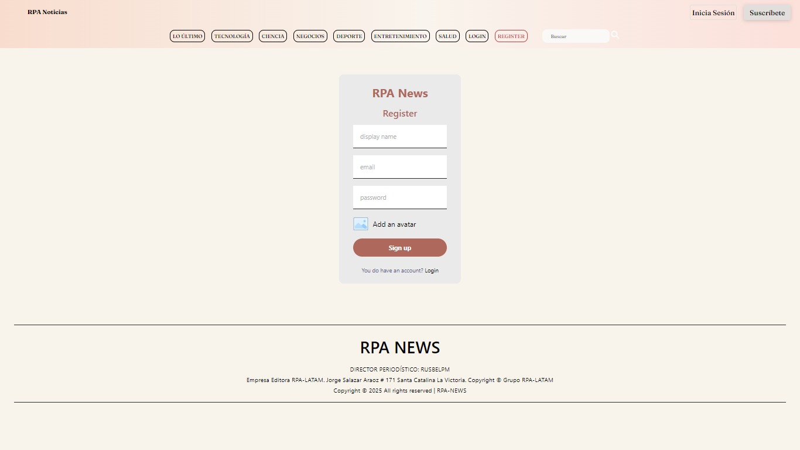

# RPA NEWS

## Dependecias del proyecto

| Nombre de paquete           | Versión  |
| --------------------------- | -------- |
| @testing-library/jest-dom   | ^5.14.1  |
| @testing-library/react      | ^13.0.0  |
| @testing-library/user-event | ^13.2.1  |
| @types/jest                 | ^27.0.1  |
| @types/node                 | ^16.7.13 |
| @types/react                | ^18.0.0  |
| @types/react-dom            | ^18.0.0  |
| axios                       | ^1.3.2   |
| firebase                    | ^9.17.1  |
| react                       | ^18.2.0  |
| react-dom                   | ^18.2.0  |
| react-router-dom            | ^6.8.0   |
| react-scripts               | 5.0.1    |
| typescript                  | ^4.4.2   |
| web-vitals                  | ^2.1.0   |

## Secuencia de carpetas

- src
  - components
    - carousel
    - footer
    - form
    - main
    - search-news
    - the-last
    - ui
  - context
  - global-component
    - loading
  - helpers
    - axios
    - data
  - hooks
    - useNews
    - useSearch
  - interfaces
    - interface
  - layout
    - layoutContent
    - layoutGrid
  - page
    - categories
    - login
    - register
    - note-news
    - search
    - the-last
  - router
    - app-router
    - routes
  - styles
    - base
    - components
    - global-components
    - layout
    - page
    - variables

### Metodologia a usar

- Metodo BEM

### Organización

- [Jira](https://miniproyectorpalatam.atlassian.net/jira/software/projects/MIN/boards/1)

### Diseños

- 
- 
- 
- 
- 

## Pasos para colaborar con el proyecto

- Habre la terminal en la carpeta donde quieres realizar el proyecto.
- Coloca git clone ruta-del-proyecto (lo encontraras en el boton <>Code - HTTPS)
- Crea tu propia rama > git branch nombre--rama
- Ve a la rama donde quieres colaborar > git checkout nombre--rama
- Realiza los cambios respetando la organizacion de las carpetas y el metodo BEM.
- Por ultima publica tu rama.
- Recuerda que estamos usando la api de NewsApi por lo que nos permite solo hacer
  una cantidad limitada de peticiones, crea tu propia apiKey.
